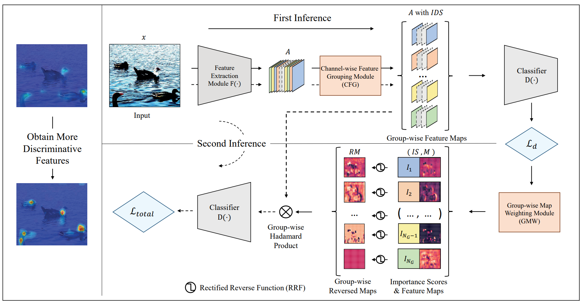

## Group-wise Inhibition based Feature Regularization for Robust Classification (ICCV 2021)

> [arXiv Paper](https://arxiv.org/abs/2103.02152)

## Requirements
*   numpy>=1.17.2
*   Pillow>=6.2.0
*   pytorch>=1.6.0
*   torchvision>=0.7.0


## Datasets
* CIFAR-10 and CIFAR-100 datasets can be downloaded by torchvision. Note that you can set
`torchvision.datasets.CIFAR10(..., download=True)` in `./Data/get_data.py` to download the corresponding dataset and keep the directory path.

* CIFAR-10-C and CIFAR-100-C datasets can be downloaded with:
```
    mkdir -p ./data/cifar
    curl -O https://zenodo.org/record/2535967/files/CIFAR-10-C.tar
    curl -O https://zenodo.org/record/3555552/files/CIFAR-100-C.tar
    tar -xvf CIFAR-100-C.tar -C data/cifar/
    tar -xvf CIFAR-10-C.tar -C data/cifar/
```
## Usage
* CIFAR-10 using TENET Training with GPU 0, `/dataset/CIFAR10/` is your directory path of dataset.
```
python main.py --dataset CIFAR10 --data_root /dataset/CIFAR10/ --gpu_id 0
```

* CIFAR-100 using TENET Training with GPU 0, `/dataset/CIFAR100/` is your directory path of dataset.
```
python main.py --dataset CIFAR100 --data_root /dataset/CIFAR100/ --gpu_id 0
```

## Trained Weights
The trained model weights are available in current directory.
* The model trained with TENET Training on CIFAR-10, which has a 3.50% Top-1 error rate on clean CIFAR-10 dataset and a 12.31% Top-1 mean corruption error rate on CIFAR-10-C dataset.
```
./trained_weights/CIFAR-10_resnext29.pth
```
* The model trained with TENET Training on CIFAR-100, which has a 19.46% Top-1 error rate on clean CIFAR-100 dataset and a 35.73% Top-1 mean corruption error rate on CIFAR-100-C dataset.
```
./trained_weights/CIFAR-100_resnext29.pth
```


## A more complete repo is coming soon
**The current repository is the version originally submitted to CMT as supplementary materials.**

We are working to update the code (DDP training on ImageNet, adversarial training, etc.) and model parameters, making them easy-to-use.

## Citation
Please cite our work if it's useful for your research.
```
@article{liu2021group,
  title={Group-wise Inhibition based Feature Regularization for Robust Classification},
  author={Liu, Haozhe and Wu, Haoqian and Xie, Weicheng and Liu, Feng and Shen, Linlin},
  journal={arXiv preprint arXiv:2103.02152},
  year={2021}
}
```
